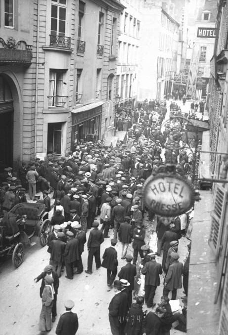
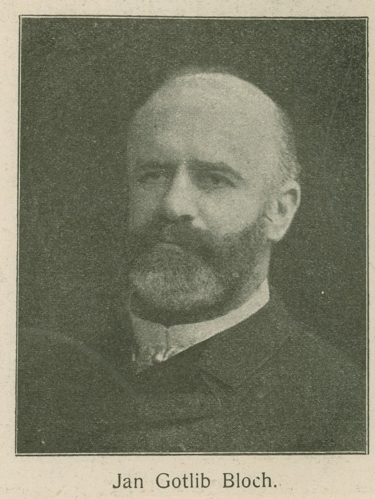
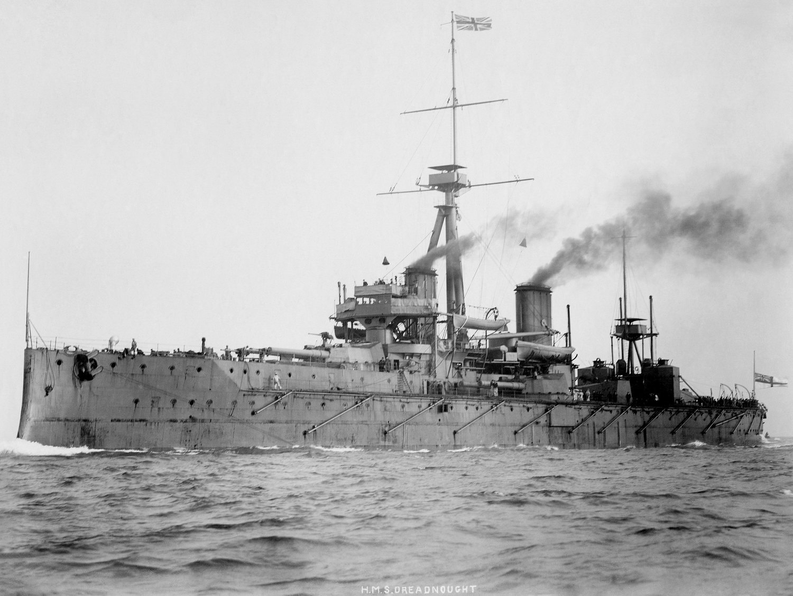
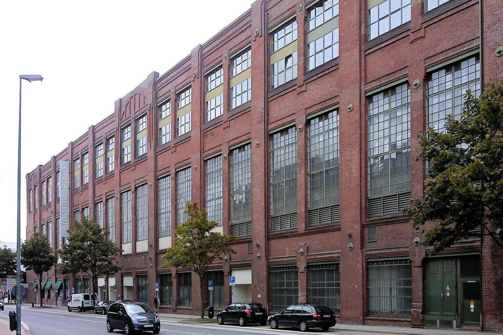
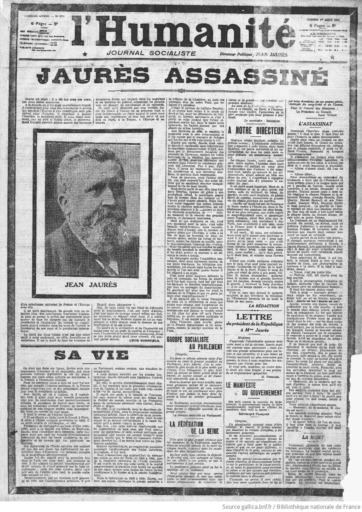

It is a quarter to ten in the evening on the 31st of July 1914, and the day's heat is still sitting on Paris. At the [Café du Croissant](<https://en.wikipedia.org/wiki/Caf%C3%A9_du_Croissant>), on the corner of rue Montmartre in the newspaper district, the windows stand open to the street because of it. [Jean Jaurès](<https://en.wikipedia.org/wiki/Jean_Jaur%C3%A8s>) sits with his back to one of them, a thin curtain between his chair and the pavement. He is fifty-four, heavy, exhausted, and he has spent the day begging.

That morning, at the Chamber of Deputies, Jaurès learned that Austria was mobilising and that Germany had declared a ["state of danger of war,"](<https://en.wikipedia.org/wiki/Assassination_of_Jean_Jaur%C3%A8s>) a phrase of bureaucratic precision. He asked to see the prime minister and was given an under-secretary instead: a young man named [Abel Ferry](<https://en.wikipedia.org/wiki/Abel_Ferry>). Jaurès told him that if the government stumbled into war, he would denounce the crazy ministers who let it happen. Ferry's reply was not a threat; witnesses describe it as distressed, almost tender. *But my poor Jaurès, they will kill you at the first street corner.*

Now he is at dinner with his editors, dictating pieces for tomorrow's *L'Humanité* between courses. Tomorrow's paper is meant to carry his appeal against the war. On the pavement outside, behind the curtain, a 28-year-old archaeology student named [Raoul Villain](<https://en.wikipedia.org/wiki/Raoul_Villain>) has been watching him for days. He has located Jaurès's flat, his newspaper, the café where he is a regular. He has bought a [.32 Smith & Wesson](<https://en.wikipedia.org/wiki/.32_S%26W>)and practised with it.

At 9:40 he pulls the curtain aside and fires twice.

One bullet enters Jaurès's skull. The other buries itself in the woodwork around a mirror. Someone cries out that Jaurès is dead; by morning word on the street is *they have killed Jaurès*, the myth forming faster than the blood could dry. He is dead within five minutes. Three days later, Germany declares war on France.

*Rue du Croissant, Paris, 1914.*

I have been thinking about that open window for a while, because Europe is rearming again. And again, military spending is treated as a good in itself: not a means to an end but the end itself, the billions offered as the proof of seriousness.

European military spending hit [€864 billion last year](<https://www.kielinstitut.de/publications/news/europe-is-spending-more-on-defence-than-ever-before-time-to-spend-smart/>), growing at a pace the continent's western half has not seen since the Cold War. The EU has a plan to mobilise [€800 billion for defence](<https://www.europarl.europa.eu/RegData/etudes/BRIE/2025/769566/EPRS_BRI(2025)769566_EN.pdf>) and a new borrowing instrument, blandly named SAFE, to raise the first €150 billion. At The Hague, of all places, NATO's members promised to reach [five percent of GDP by 2035](<https://www.nato.int/en/what-we-do/introduction-to-nato/defence-expenditures-and-natos-5-commitment>). Germany's parliament has voted a [new military service law](<https://www.deutschland.de/en/news/bundestag-approves-law-for-new-military-service>): every man born in 2008 or later now receives a questionnaire about his willingness to serve and the medical exam is compulsory again. Sweden [summons thirty thousand of its 18-year-olds to muster and takes eighty-five hundred](<https://ebco-beoc.org/sweden/2025>), the service now so oversubscribed that most of those the state itself calls in are sent home.

Let's clear the air first: the threat is real. Russia's war is not hypothetical; the American umbrella is failing in plain sight; a Europe that cannot defend itself is not safe and no serious person in 1914 or 2026 argues otherwise. Jaurès also did not argue otherwise, which is why I'm summoning his ghost.

The people who loved Europe most before 1914 were not warning against defence. They were warning against something else, quieter and more dangerous: what arming does to the society that arms. Build a war machine, they said, and you build alongside it a bloc of people whose careers, profits and identities depend on the threat never going away, an *escalation constituency* that will outlive any threat assessment and call every path to de-escalation naïve. The machine, once built, lobbies for its own enlargement. And so the real question, then as now, was never whether to build the machine. It was whether to build the brakes.

This is the story of how Europe built the machine and forgot the brakes, again, told through the three men who saw it coming: the one who calculated it, the one who named the people who profited from it, and the one who died for it.

## 1898: the year of the diagnosis and of the disease

[Jan Bloch](<https://en.wikipedia.org/wiki/Jan_Gotlib_Bloch>) was a Warsaw banker who had made his fortune financing railways, and he approached the next European war as an engineering problem with a calculable answer. For years he worked through it with ballistics tables and actuarial data, the ranges of the new magazine rifles, the rate of fire of the machine gun, the yields of high-explosive shell, the grain reserves of the great powers. In 1898 he published the result in [six volumes](<https://archive.org/details/futureofwarinits00blocuoft>).

*Jan Bloch, the banker who calculated the war.*

His conclusion was that the coming war had already been decided by the hardware. The frontal attack was finished; the defender, dug in, would mow down anything that walked toward him; the armies would scrape into the earth and stay there. There would be no decisive battle at all, only an entrenched stalemate grinding through millions of conscripts while the economies behind them bled out. "It will be not fighting but famine," he wrote, "not the slaying of men but the bankruptcy of nations and the break-up of the whole social organization." He even predicted that disease would kill more men than steel. Sixteen years before the Somme, a banker had worked out the Somme.

1898 is also the year the disease arrived. That April, Germany passed the [First Naval Law](<https://en.wikipedia.org/wiki/German_Naval_Laws>), the founding act of the battleship race with Britain. Two weeks later, Admiral Tirpitz's office founded the [Navy League](<https://en.wikipedia.org/wiki/Navy_League_(Germany)>) to sell the fleet to the German public. That August, Tsar Nicholas II, after reading Bloch, issued the [rescript](<https://avalon.law.yale.edu/19th_century/hag99-01.asp>) calling the world's first disarmament conference. The diagnosis and the disease, published in the same year.

The Hague conference duly met in 1899; Bloch went in person and pressed copies of his work on the delegations of 26 states, to little avail. In 1901 he presented his findings to [Britain's leading military think tank](<https://intellectualtakeout.org/2016/08/jan-bloch-the-man-who-prophesied-world-war-i/>), where the chairman thanked him and suggested that cavalry and artillery would still prove decisive against entrenchment. He died in 1902. Twelve years later the trenches confirmed his dark arithmetic.

Did they read Bloch? They did. That is the part that should keep you up at night. Statesmen read him; the Tsar convened a conference because of him; his volumes sold across the continent. Europe walked into the war he described with the information in hand. We like to believe that knowing is most of stopping; 1914 is the proof that knowing and stopping are different faculties, and that a society can hold the full description of its own catastrophe and proceed anyway. At this point the parallels with climate inaction should be screaming at you.

We are better documented than they were. Our Blochs publish constantly: wargame results, escalation studies, casualty models for the Suwałki corridor. Nobody will be able to say we weren't told. They couldn't say it in 1914 either.

## The machine hires a constituency

The machine grew and grew, and the way it grew matters more than any moral.

*HMS Dreadnought, 1906.*

In 1906 Britain launched [HMS Dreadnought](<https://en.wikipedia.org/wiki/HMS_Dreadnought_(1906)>), a battleship so advanced it made every existing fleet, including Britain's own, obsolete overnight. Germany began building its answer. Each new ship was built for "safety"; each made the other side feel less safe; the more they built, the more fear there was to build against. By 1909 the British public, whipped by press and opposition into a panic that Germany was secretly out-building them, was chanting a slogan: [we want eight and we won't wait](<https://en.wikipedia.org/wiki/Anglo-German_naval_arms_race>). By 1914 Britain had twenty-nine capital ships of the new type to Germany's seventeen and neither country could tell you what problem the ships had solved.

But underneath the fear, something more durable was being poured: an economy. Shipyards on the Clyde and the Tyne, steelworks in Essen and Sheffield, and around them patriotic leagues, naval pageants, newspapers that learned panic sells papers, careers that rose with the estimates. The German Navy League reached [over a million members](<https://en.wikipedia.org/wiki/Navy_League_(Germany)>); Krupp, the arms house of Essen, was a corporate member, which is one way for a product to join its own fan club. Whole regions came to live off the naval estimates. A constituency now existed whose prosperity required the next ship and the threat that justified it.

*Machine shop at the Krupp works, Essen.*

Someone saw it. He stood up inside the German parliament and named the business model. In April 1913, Karl Liebknecht, a Social Democrat and a lawyer, used the Reichstag tribune to expose what became known as the [Kornwalzer affair](<https://de.wikipedia.org/wiki/Kornwalzer-Skandal>): Krupp employees had been bribing war ministry officials for years to obtain secret procurement information. He had first handed his evidence to the war minister and waited in vain; his scrupulousness did not save him. This, he told the chamber, was "worse than Panama," then the byword for corruption on the grandest scale. And he drew the general lesson in [a sentence](<https://www.marxists.org/history/usa/parties/cpusa/voices-of-revolt/04-Karl-Liebknecht-VOR-ocr.pdf>) that has lost nothing in more than a hundred years: the arms industry does not feed on the peace and happiness of peoples; dissension, danger of war, war itself is its food. *More hate among the peoples means more profit.* He was not being poetic. He was describing an incentive structure.

Fast-forward to today for a second. The €800 billion and the €150 billion of SAFE money now moving through Brussels. The five percent target, after which Europe's NATO members alone could be spending an extra [€831 billion every year](<https://www.intereconomics.eu/contents/year/2026/number/2/article/can-europe-deliver-nato-s-five-percent.html>), a sum with its own gravitational field. The defence stocks that have carried European stock indices for two years; the business press, having learned nothing from its own history, [cheerfully lists the industries riding the boom](<https://www.euronews.com/business/2026/05/29/five-industries-benefiting-from-europes-defence-spending-boom>).

None of this is a conspiracy and that is precisely the point; it wasn't one in 1909 either. It is factory openings in depressed regions, engineering careers, doctoral grants, town budgets. The Navy League's million members did not think they were lying. But once a threat pays this many salaries, de-escalation stops being a policy question and becomes a labour-market question and no democracy handles those coolly. Jobs have a gravity that pulls both left and right. The constituency does not need to want war. It only needs to find every path away from the threat vaguely unserious, slightly naïve, never quite the right week.

## The man who wanted both

The lazy version of Jaurès calls him a pacifist. But in 1911 he published a five-hundred-page book on military organisation, [L'Armée nouvelle](<https://en.wikipedia.org/wiki/Jean_Jaur%C3%A8s>), designing a citizen army built for one purpose: the defence of French soil. He had no patience for the Marxist line that workers have no fatherland; he wrote against it explicitly. What he opposed was the machine without brakes: the 1913 law stretching conscription to three years to feed an offensive doctrine, the blank cheques France was signing for Tsarist Russia, the strangling of diplomacy while the estimates grew. Defence and de-escalation in the same hand. That was the whole position and it earned him the hatred of both the ultra-left and the nationalist right.

He fought the three-year law in the open. In May 1913, at [Pré-Saint-Gervais](<https://www.politika.io/en/notice/jaures-at-presaintgervais>) outside Paris, he spoke against it to a crowd of 150,000 and a press photographer named Branger caught him mid-sentence, arm flung out over a sea of hats and caps: the image of him France keeps. At [Vaise](<http://www.jaures.eu/ressources/de_jaures/discours-de-vaise-25-juillet-1914/>), near Lyon, on the 25th, he told his audience what was coming with a precision Bloch would have recognised: no longer an army of 300,000 as in the Balkan wars, but *four, five, six armies of two million men. What a massacre, what ruin, what barbarism!*

Privately, the same day, he confessed to a friend in government where he thought it would end: *and anyway, we will be killed first*. On the 29th he was in Brussels, embracing Hugo Haase, the German socialist leader, before an enormous anti-war rally; the Socialist International voted to convene an emergency congress in Paris on the 9th of August. But there would be no 9th of August because the pace of the collapse outran even the people running to stop it.

Meanwhile, the nationalist press had spent months rehearsing his murder in print. Would not a general who had Jaurès shot against a wall, [asked one Paris daily that July](<https://en.wikipedia.org/wiki/Assassination_of_Jean_Jaur%C3%A8s>), be doing his most elementary duty? When the shot finally came through the café window, it had been thoroughly imagined, priced and pre-approved. Villain pulled a trigger that was already loaded.

Jaurès's position, defence and diplomacy in the same hand, is almost unsayable again. Try it at a Brussels dinner: argue for the €800 billion *and* for planning what arms control with Moscow would look like the day the guns quiet. Watch the second half of the sentence classify you and isolate you.

Nobody needs to invent reasons for Europe to arm; Washington supplies a new one every few weeks. In May the White House ordered [five thousand troops out of Germany](<https://time.com/article/2026/05/03/us-withdrawal-germany-nato-spain/>). The allies protested. Weeks later the same White House announced five thousand troops for Poland, and NATO officials told reporters they were [bewildered](<https://www.pbs.org/newshour/world/nato-allies-bewildered-by-trumps-about-face-on-u-s-troop-moves-in-europe>), which is not a word alliances like to use on the record. Congress, for its part, trusts the president so little that it has [written  a law](<https://www.euronews.com/my-europe/2026/05/05/can-us-law-stop-trump-from-withdrawing-troops-from-europe>): American troop numbers in Europe cannot drop below 76,000 without certifications, consultations and a report to Capitol Hill. Sit with that for a moment. The American security guarantee now comes with a legally mandated floor, the way a failing company's promises come with collateral. An umbrella like that is the best argument for a European defence anyone has ever made. The argument for also building the brakes is a different conversation, and Europe keeps letting the first swallow the second.

## Nine forty in the evening

Let me walk you back to the café now, to look at it through everything you now know.

The two shots. The scream. The crowd of five thousand that gathers within hours outside the *L'Humanité* offices. The next morning the paper he founded appears with [a black border](<https://gallica.bnf.fr/ark:/12148/bpt6k253902z>) where his appeal against the war was meant to run. The government, fearing insurrection, holds two cavalry regiments in Paris; the police prefect reports instead an unnerving calm, workers "much more interested in the current state of Europe," grief already folded into mobilisation. The posters calling France to the colours go up on every town hall that afternoon.

*L'Humanité, 1 August 1914, black-bordered.*

Then the aftermath, at the speed it happened. On the 4th of August Jaurès is given a state funeral; over his coffin, the leader of the CGT, the union federation that three weeks earlier was planning anti-war demonstrations, calls the workers to arms. That same afternoon, the socialist deputies voted the war credits, unanimously. The *union sacrée*, France's wartime truce of parties, is assembled literally over his body. In Berlin the SPD votes its credits too. By December 1914, in all of Germany's parliament, the number of deputies still voting no has fallen to exactly one: Karl Liebknecht. He is conscripted, then imprisoned. In January 1919, Freikorps officers beat him half-conscious and shoot him in the Tiergarten. During my time in Berlin I used to take my son there quite often: the garden keeps its history very quietly.

The smaller fates rhyme too. Abel Ferry, the young under-secretary who told Jaurès they would kill him, went to the front as a soldier-deputy and was killed by shellfire in 1918; the war found everyone who had watched it coming. And Villain? He sits out the entire conflict in pre-trial detention, which more than one historian has noted was the safest place in France for a man of military age. Tried at last in March 1919, before jurors marinated in four years of sacred union, he is acquitted, eleven votes to one. There is a story still told in France that the court ordered Jaurès's widow, the civil plaintiff, to pay the costs of the trial; historians note that no surviving document confirms it, but the legend endures because it is exactly what that verdict felt like. Anatole France, seventy-four years old, writes in fury: *Workers, Jaurès lived for you, he died for you. A monstrous verdict proclaims that his assassination is not a crime. Workers, watch out!* Villain retires quietly to Ibiza. In September 1936, in the opening chaos of the Spanish Civil War, anarchist militiamen on the island shoot him, possibly without knowing who he was. The historian Enzo Traverso calls the whole sequence from 1914 to 1945 the [European civil war](<https://www.versobooks.com/products/137-fire-and-blood>), Europe's second Thirty Years' War, one long epoch of blood and ashes with intermissions. Read it his way and the ledger closes cleanly: the war Villain helped inaugurate took twenty-two years to circle back for him.

The café, by the way, is still there, at 146 rue Montmartre. There is a plaque, and lunch service.

Bloch was ignored. Liebknecht was jailed. Jaurès was shot. The machine got built. The brakes never did.

I can hear the objection, because it is the strongest one there is: 1938. The one time the peace camp fully won the argument in Europe, the democracies disarmed their way to Munich and correcting that mistake cost the world its worst war. I am not going to argue that away; against an enemy who can only be defeated, not deterred, hesitation is the killer, and Russia has already started its war, which makes 2026 unlike 1909 in the most important way possible. If your takeaway from Jaurès is that Europe should not rearm, you have him exactly backwards: *L'Armée nouvelle* is a rearmament book. But notice what the 1938 lesson asks of us: to read the enemy right. The 1914 lesson asks something harder: to read ourselves right. Arming, justified or not, creates a constituency, and the constituency outlives the threat assessment. One claim depends on Russia's intentions. The other depends on ours.

## The brakes

In January 1961 a five-star general, on his way out of the American presidency, gave the constituency its lasting name. "We must guard against the acquisition of unwarranted influence, whether sought or unsought, by the military-industrial complex," [Eisenhower said](<https://www.archives.gov/milestone-documents/president-dwight-d-eisenhowers-farewell-address>) and everyone remembers that sentence. Fewer remember the brake he proposed in the next breath: *only an alert and knowledgeable citizenry* could keep the machine meshed with peaceful goals. Not a committee. Not an audit. Citizens who understand the machine well enough to refuse its logic when the moment comes. The warning was heeded roughly as well as Bloch's.

So what would brakes look like, concretely, for the Europe now writing the cheques? Parliamentary teeth over the SAFE billions, so that the fastest-moving money in EU history does not become the least examined. Arms-export rules that survive contact with full order books. A diplomatic budget and a diplomatic imagination that grow with the defence budget instead of shrivelling beside it: someone, somewhere in Brussels, should already be drafting the boring annexes of a future European security arrangement, if only so the option exists on the shelf. Off-ramps designed in advance, the way engineers design them, before the vehicle is moving. And of course the 31 July 1914 kind of brake: protection for the people who say *enough* at the moment saying it is least popular, because that is exactly the moment a culture starts loading triggers.

Jaurès sat with his back to an open window because the evening was hot and the work could not wait. He knew the risk; Ferry had told him to his face that morning and he had gone back to the paper and kept dictating. Europe is allowed to defend itself; he would have insisted on it. But a continent that builds the machine and not the brakes has already made its choice. It just does not know it yet.

The window is open again. It would be good, this time, to know who is standing behind the curtain and to remember that the man they shot was Europe's brakes.
